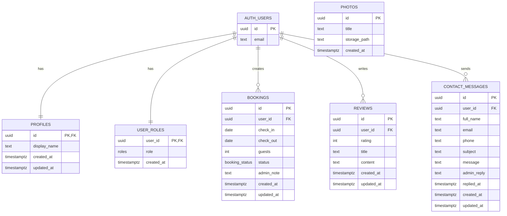

# Villa Blue Summer - Villa Booking Application

Client-server villa booking app built with vanilla JavaScript + Bootstrap on the frontend and Supabase (DB, Auth, Storage, Edge Functions) on the backend.

## Project Description

This project is for booking the whole villa (not individual rooms). It supports:
- public pages (home, gallery, reviews, contacts)
- authenticated user flows (register, login, profile)
- admin workflows (manage bookings, messages, gallery photos)

## Architecture

- Frontend: HTML, CSS, JavaScript (ES modules), Bootstrap 5
- Backend: Supabase Postgres + Auth + Storage + Edge Functions
- Build: Node.js, npm, Vite
- Deployment target: Netlify (or similar static host)

### App Flow

- SPA-style client routing in `src/main.js` with multi-screen pages in separate files.
- Data access via service modules in `src/services/`.
- RLS-based access control in PostgreSQL policies.

## Implemented Pages

- `/` and `/home` - Home
- `/booking` - Booking
- `/gallery` - Gallery
- `/reviews` - Reviews
- `/contacts` - Contacts
- `/login` - Login
- `/register` - Register
- `/profile` - User profile
- `/admin` - Admin panel

## Authentication and Roles

- Supabase Auth for registration/login/logout.
- Roles are implemented using `public.user_roles` (`admin`, `user`).
- Route guards and role checks are applied in frontend routing.
- RLS policies restrict data access per user/admin role.

## Database Schema (Visualization)

Main domain tables are in `public` schema and reference `auth.users`.



## Storage

- Bucket: `villa-photos`
- App stores gallery image files in Supabase Storage.
- Metadata is stored in `public.photos`.

## Migrations

Schema/policy changes are tracked in `migrations/`.

Key migration files include:
- `20260224_auth_roles_booking_reviews_messages.sql`
- `20260224_storage_policies.sql`
- `20260224_security_policy_fixes.sql`
- `20260224_reviews_rpc_and_profile_perf_indexes.sql`
- `20260224_contact_messages_user_delete_cascade.sql`
- `20260224_cleanup_orphaned_user_content_and_profile_delete_trigger.sql`

## Local Development Setup

### Prerequisites
- Node.js 18+
- npm 8+

### 1) Install

```bash
npm install
```

### 2) Environment

Create `.env` with:

```bash
VITE_SUPABASE_URL=...
VITE_SUPABASE_ANON_KEY=...
```

For email reply Edge Function, configure in Supabase project secrets:

```bash
RESEND_API_KEY=...
ADMIN_REPLY_FROM_EMAIL=Villa Blue Summer <noreply@your-domain.com>
ADMIN_REPLY_TEST_TO_EMAIL=your-verified-email@example.com
```

### 3) Run

```bash
npm run dev
```

### 4) Build

```bash
npm run build
```

## Utility Scripts

### Upload local gallery files to Supabase Storage

```bash
npm run upload:gallery
```

Required env (either mode):
- service-role mode: `SUPABASE_SERVICE_ROLE_KEY`
- admin-login mode: `SUPABASE_ADMIN_EMAIL`, `SUPABASE_ADMIN_PASSWORD`

Optional:
- `CLEAN_GALLERY_BUCKET=true` to wipe bucket before upload

### Seed sample users/data

```bash
npm run seed:sample
```

Requires:
- `SUPABASE_SERVICE_ROLE_KEY`

This creates/updates sample auth users:
- `stefie@gmail.com / pass123`
- `teo@gmail.com / pass123`
- `petkata@gmail.com / pass123`

These sample credentials are tested and working on the deployed app.

And seeds sample `profiles`, `user_roles`, `bookings`, `reviews`, `contact_messages`.

## Deployment (Netlify)

Live URL: https://bluesummervilla.netlify.app/

1. Connect repo
2. Build command: `npm run build`
3. Publish dir: `dist`
4. Set env vars:
   - `VITE_SUPABASE_URL`
   - `VITE_SUPABASE_ANON_KEY`

## Key Folders and Files

- `src/main.js` - routing, page rendering, auth-aware navigation
- `src/pages/` - page-level UI modules
- `src/services/` - Supabase data access layer and business logic
- `src/components/layout.js` - navbar + footer
- `src/styles.css` - global styling and responsive behavior
- `migrations/` - SQL schema/policy history
- `scripts/` - seeding and storage upload utilities
- `supabase/functions/send-admin-reply-email/index.ts` - email reply edge function

## How to Test

### User flow
1. Open https://bluesummervilla.netlify.app/
2. Login with `stefie@gmail.com / pass123`
3. Create a booking from `/booking`
4. Open `/profile` and verify booking appears
5. Send a contact message from `/contacts` and verify it appears in profile messages

Expected result:
- User can login, create booking, and see own data in profile.

### Admin flow
1. Login with an admin account
2. Open `/admin`
3. Change booking status (Pending/Confirm/Reject/Cancel)
4. Reply to a user message
5. Verify the user can see the reply in `/profile`

Expected result:
- Admin actions persist and are visible to the corresponding user.

### Gallery upload flow
1. Open `/admin` and upload a photo from Gallery Photos
2. Open `/gallery` and verify the new photo is visible
3. (Optional) Run `npm run upload:gallery` locally to bulk upload from `images/`

Expected result:
- Uploaded images are stored in Supabase Storage and rendered in gallery.

## Notes

- The app uses client-side routing with full-path URLs (e.g. `/gallery`, `/admin`).
- If hosting requires SPA rewrites, configure host redirects to `index.html`.
